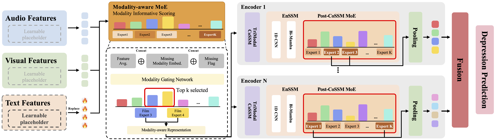

# DepM³

**DepM³: Modality-Agnostic Mixture-of-Experts with Mamba for Depression Detection**

---

## Abstract

Multimodal depression detection has gained significant attention, yet most existing approaches assume complete modality availability at inference time. Addressing this limitation requires both adaptive fusion that adjusts computation based on which modalities are available and efficient temporal modeling for the long behavioral sequences typical of depression analysis, two capabilities that existing methods rarely provide jointly. We propose DepM³, a modality-agnostic framework that unifies efficient long-range temporal modeling with modality-aware conditional computation for robust multimodal depression detection. DepM³ introduces a two-stage Mixture-of-Experts mechanism: a Modality-aware MoE that adapts modality-specific features prior to fusion, and a Post-CoSSM MoE that routes fused representations based on explicit modality presence scores, enabling adaptive computation where experts specialize for different modality subsets. A diversity-regularized multi-encoder ensemble further captures complementary depression indicators, improving robustness under incomplete modality scenarios. Built on a Mamba-based state space model, the framework achieves linear-time sequence processing suited to the temporally diffuse behavioral patterns associated with depression. We conduct comprehensive experiments on two post-level benchmarks (D-Vlog and LMVD), one user-level longitudinal benchmark (MUD3), and one clinical interview benchmark (DAIC-WoZ), outperforming full- and missing-modality baselines on three of the four benchmarks and remaining competitive on the fourth, while degrading gracefully under missing and corrupted modality conditions.

---

## Framework

<p align="center">
  
</p>

DepM³ consists of three main components:

1. **Modality-aware MoE (Pre-CoSSM)**
   FiLM-conditioned expert routing that adapts each modality's features before fusion, informed by modality identity and missing flags.

2. **Presence-conditioned MoE (Post-CoSSM)**
   Expert routing over the fused representation, conditioned on continuous modality presence scores within the Mamba-based sequence encoder.

3. **Diversity-regularized Multi-encoder Ensemble**
   Independent encoders trained with a diversity objective and combined by attention-based late fusion for robustness under uncertain missing patterns.

---

## Repository Structure

```text
depm3_release/
├── post_level/          # DepM³ training: D-Vlog / LMVD / DAIC-WoZ
│   ├── README.md
│   ├── main_multiencoder_ensemble.py
│   ├── models/
│   ├── datasets/
│   └── config/
│
├── user_level/          # DepM³ training: MUD3 (user-level)
│   ├── README.md
│   └── main_mud3.py
│
├── evaluation/          # missing/corrupted-modality evaluation + efficiency
│   └── README.md
│
├── data_preparation/    # DAIC-WoZ feature builder
│   └── README.md
│
├── assets/
│   └── framework.png
│
└── README.md
```
