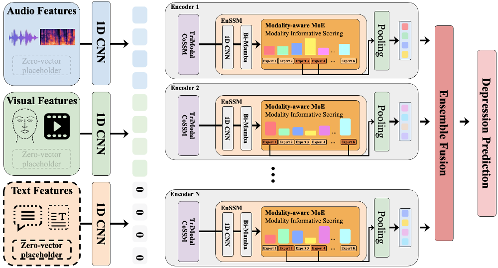

# DepM³: Modality-Agnostic Mixture-of-Experts with Mamba for Depression Detection

**Multi-Encoder Ensemble with Mixture of Experts for Multimodal Depression Detection using State Space Models**

> A multi-encoder ensemble framework that processes multimodal inputs (Audio + Visual + Text) by combining Mamba-based State Space Models with Mixture of Experts for depression detection.

---

## Architecture Overview

<p align="center">
  
</p>

### Key Components

| Component | Description |
|-----------|-------------|
| **TriModalCoSSM** | Collaborative State Space Model — Processes three modalities (Audio, Visual, Text) in parallel via Bidirectional Mamba, learning cross-modal interactions through a shared state transition matrix A |
| **EnSSM_MoE** | Enhanced SSM with Mixture of Experts — Performs dynamic expert routing on fused multimodal features. Modality-aware gating enables robustness to missing modalities |
| **Ensemble Fusion** | Fuses outputs from multiple encoders via Early (feature-level) or Late (logits-level) fusion strategies |
| **Diversity Loss** | Cosine similarity-based diversity loss between encoders, encouraging each encoder to learn distinct patterns |

---

## Project Structure

```
DepMamba_MoE_ensemble/
├── README.md
├── main_multiencoder_ensemble.py     # End-to-end training script
├── config/
│   ├── config.yaml                   # Base (single encoder) configuration
│   ├── config_moe.yaml               # MoE-specific configuration
│   └── config_ensemble.yaml          # Multi-encoder ensemble configuration
└── models/
    ├── __init__.py
    ├── base.py                       # Base network classes
    ├── DepMamba_multiencoder_ensemble.py  # Main ensemble model
    ├── mamba/
    │   ├── bimamba.py                # Bidirectional Mamba (v1/v2)
    │   ├── mamba_blocks.py           # Mamba block wrappers
    │   ├── mm_bimamba.py             # Multimodal Bidirectional Mamba
    │   ├── trimodal_mamba.py         # Tri-modal Mamba (A+V+T)
    │   └── selective_scan_interface.py   # Selective scan CUDA kernels
    └── moe/
        ├── __init__.py
        └── multimodal_moe.py         # Multimodal Mixture of Experts
```

---

## Requirements

- Python >= 3.8
- PyTorch >= 2.0
- [mamba-ssm](https://github.com/state-spaces/mamba)
- [causal-conv1d](https://github.com/Dao-AILab/causal-conv1d)
- [speechbrain](https://github.com/speechbrain/speechbrain)
- einops
- PyYAML
- tqdm
- numpy

---

## Usage

### Training

```bash
# Default: 3 encoders, late fusion (weighted), MoE enabled
python main_multiencoder_ensemble.py

# Custom configuration
python main_multiencoder_ensemble.py \
    --num_encoders 3 \
    --ensemble_stage late \
    --fusion_type weighted \
    --use_moe True \
    --num_experts 6 \
    --top_k_experts 2 \
    --dataset dvlog \
    --epochs 120 \
    --batch_size 16 \
    --learning_rate 8e-5 \
    --gpu 0

# LMVD dataset
python main_multiencoder_ensemble.py \
    --dataset lmvd \
    --num_encoders 3 \
    --fusion_type weighted
```

